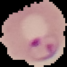

**Image Classification Using CNN For Malaria Parasitized Cells**

As part of my continued effort to learn new skills I wanted to try my hand at some image classification problems using deep learning. The canned Convolutional Neural Network tutorial seems to focus on either classifying dog breeds as multiclass problem or a binary classification of cat versus dog.

As a biomedical informatics practitioner I wanted the problem to be more focused on my interests and chose to do a binary classification problem on Malaria Parasitized cells versus uninfected cells.

This Dataset is taken from the official NIH Website: https://ceb.nlm.nih.gov/repositories/malaria-datasets/ 

The first step will be to load the appropriate packages, we will be using Keras (Tensorflow backend), os, Pillow, and Numpy.


```python
from keras.layers import Dense, BatchNormalization, Dropout
from keras.preprocessing.image import ImageDataGenerator
from keras.preprocessing import image
import os
from PIL import Image
from keras.models import Sequential
from keras.layers import Conv2D
from keras.layers import MaxPooling2D
from keras.layers import Flatten
import numpy as np
from IPython.display import Image
from IPython.core.display import HTML
```

Let's take a look at both a Parasitized cell and an Uninfected cell.


```python
UPATH = "Desktop\\cell_images\\Train\\Uninfected\\"
print('Uninfected')
Image(filename = UPATH + "C89P50ThinF_IMG_20150820_163728_cell_131.png", width=100, height=100)
```

    Uninfected
    


```python
PPATH = "Desktop\\cell_images\\Train\\Parasitized\\"
print('Parsitized')
Image(filename = PPATH + "C84P45ThinF_IMG_20150818_101257_cell_78.png", width=100, height=100)
```

    Parsitized
    





Next we will try and better understand our data set and get some size statistics on the images.


```python
def get_size_statistics(DIR):
  heights = []
  widths = []
  for img in os.listdir(DIR): 
    path = os.path.join(DIR, img)
    data = np.array(Image.open(path)) #PIL Image library
    heights.append(data.shape[0])
    widths.append(data.shape[1])
  avg_height = sum(heights) / len(heights)
  avg_width = sum(widths) / len(widths)
  print("Average Height: " + str(avg_height))
  print("Max Height: " + str(max(heights)))
  print("Min Height: " + str(min(heights)))
  print('\n')
  print("Average Width: " + str(avg_width))
  print("Max Width: " + str(max(widths)))
  print("Min Width: " + str(min(widths)))

get_size_statistics('desktop\\cell_images\\Train\\Parasitized')
get_size_statistics('desktop\\cell_images\\Train\\Uninfected')
```

    Average Height: 134.48243341278888
    Max Height: 385
    Min Height: 46
    
    
    Average Width: 133.11379417556225
    Max Width: 394
    Min Width: 61
    Average Height: 131.69603067675408
    Max Height: 235
    Min Height: 55
    
    
    Average Width: 131.2100735827547
    Max Width: 247
    Min Width: 58
    

After we have a better understanding of our training images we will build and compile our CNN. The primary purpose of Convolution is to extract features from the input image. 

Convolution preserves the spatial relationship between pixels by learning image features using small squares of input data.

Pooling (also called subsampling or downsampling) reduces the dimensionality of each feature map but retains the most important information

Flattening converts the matrix into a linear array so that to input it into the nodes of our neural network.

Dropout is a regulization technique where you turn off part of the network's layers randomally to increase regulization and hense decrease overfitting.


```python
model=Sequential()

model.add(Conv2D(filters=16,kernel_size=2,padding="same",activation="relu",input_shape=(50,50,3)))
model.add(MaxPooling2D(pool_size=2))

model.add(Conv2D(filters=32,kernel_size=2,padding="same",activation="relu"))
model.add(MaxPooling2D(pool_size=2))

model.add(Conv2D(filters=64,kernel_size=2,padding="same",activation="relu"))
model.add(MaxPooling2D(pool_size=2))
model.add(Dropout(0.2))
model.add(Flatten())

model.add(Dense(500,activation="relu"))
model.add(Dropout(0.2))
model.add(Dense(1,activation="sigmoid"))

model.summary()
model.compile(optimizer = 'adam', loss = 'binary_crossentropy', metrics = ['accuracy'])
```

    _________________________________________________________________
    Layer (type)                 Output Shape              Param #   
    =================================================================
    conv2d_7 (Conv2D)            (None, 50, 50, 16)        208       
    _________________________________________________________________
    max_pooling2d_7 (MaxPooling2 (None, 25, 25, 16)        0         
    _________________________________________________________________
    conv2d_8 (Conv2D)            (None, 25, 25, 32)        2080      
    _________________________________________________________________
    max_pooling2d_8 (MaxPooling2 (None, 12, 12, 32)        0         
    _________________________________________________________________
    conv2d_9 (Conv2D)            (None, 12, 12, 64)        8256      
    _________________________________________________________________
    max_pooling2d_9 (MaxPooling2 (None, 6, 6, 64)          0         
    _________________________________________________________________
    dropout_5 (Dropout)          (None, 6, 6, 64)          0         
    _________________________________________________________________
    flatten_3 (Flatten)          (None, 2304)              0         
    _________________________________________________________________
    dense_5 (Dense)              (None, 500)               1152500   
    _________________________________________________________________
    dropout_6 (Dropout)          (None, 500)               0         
    _________________________________________________________________
    dense_6 (Dense)              (None, 1)                 501       
    =================================================================
    Total params: 1,163,545
    Trainable params: 1,163,545
    Non-trainable params: 0
    _________________________________________________________________
    

Once the model has been complied we will load our training and test data using an ImageDataGenerator in batches of 100

Using Data augmentation we we can reduce overfitting on our models. This is accomplished by increasing the amount of training data using information only in our training data. To get more data, we just need to make minor alterations to our existing dataset. Minor changes such as flips or translations or rotations.


```python
train_datagen = ImageDataGenerator(rescale = 1./255, shear_range = 0.2, zoom_range = 0.2, horizontal_flip = True)
test_datagen = ImageDataGenerator(rescale = 1./255)
training_set = train_datagen.flow_from_directory('desktop\\cell_images\\Train', target_size = (50, 50), batch_size = 100, class_mode = 'binary')
test_set = test_datagen.flow_from_directory('desktop\\cell_images\\Test', target_size = (50, 50), batch_size = 100, class_mode = 'binary')

```

    Found 19298 images belonging to 2 classes.
    Found 8255 images belonging to 2 classes.
    

Fit the model with 193 steps and 10 epochs, each epoch at 193 steps and 100 batches will see each training image at least once. 


```python
model.fit_generator(training_set, steps_per_epoch = 193, epochs = 10, validation_data = test_set, validation_steps = 41,
                     workers = 4, verbose =1)
```

    Epoch 1/10
    193/193 [==============================] - 58s 301ms/step - loss: 0.1523 - acc: 0.9525 - val_loss: 0.2084 - val_acc: 0.9156
    Epoch 2/10
    193/193 [==============================] - 57s 297ms/step - loss: 0.1489 - acc: 0.9534 - val_loss: 0.1981 - val_acc: 0.9349
    Epoch 3/10
    193/193 [==============================] - 65s 335ms/step - loss: 0.1371 - acc: 0.9577 - val_loss: 0.1962 - val_acc: 0.9320
    Epoch 4/10
    193/193 [==============================] - 64s 332ms/step - loss: 0.1347 - acc: 0.9571 - val_loss: 0.1710 - val_acc: 0.9445
    Epoch 5/10
    193/193 [==============================] - 58s 299ms/step - loss: 0.1320 - acc: 0.9563 - val_loss: 0.1689 - val_acc: 0.9407
    Epoch 6/10
    193/193 [==============================] - 63s 329ms/step - loss: 0.1212 - acc: 0.9593 - val_loss: 0.1727 - val_acc: 0.9423
    Epoch 7/10
    193/193 [==============================] - 65s 335ms/step - loss: 0.1178 - acc: 0.9607 - val_loss: 0.1676 - val_acc: 0.9488
    Epoch 8/10
    193/193 [==============================] - 64s 333ms/step - loss: 0.1191 - acc: 0.9596 - val_loss: 0.1743 - val_acc: 0.9369
    Epoch 9/10
    193/193 [==============================] - 62s 320ms/step - loss: 0.1130 - acc: 0.9631 - val_loss: 0.1910 - val_acc: 0.9305
    Epoch 10/10
    193/193 [==============================] - 61s 315ms/step - loss: 0.1150 - acc: 0.9620 - val_loss: 0.1990 - val_acc: 0.9201
    


    <keras.callbacks.History at 0x2e70f02e898>


Once the model has completed training we will make a prediction on a new image not seen in either training or testing sets


```python
PATH = "Desktop\\CNN New\\Parasite\\"
Image(filename = PATH + "C33P1thinF_IMG_20150619_114756a_cell_179.png", width=100, height=100)
```


```python
test_image = image.load_img('Desktop\\CNN New\\Parasite\\C33P1thinF_IMG_20150619_114756a_cell_179.png', target_size = (50, 50))
test_image = image.img_to_array(test_image)
test_image = np.expand_dims(test_image, axis = 0)
result = model.predict(test_image)
training_set.class_indices
if result[0][0] == 0:
    prediction = 'Parasitized'
else:
    prediction = 'Uninfected'


print(prediction)
```

    Parasitized
    

Our model achieved an accuracy of .93 and correctly identified the above cell as a Malaria Parasitized cell!
